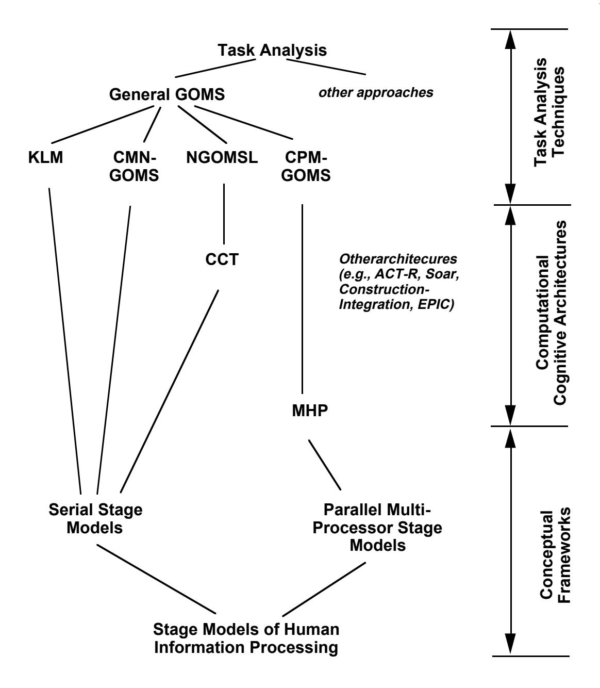
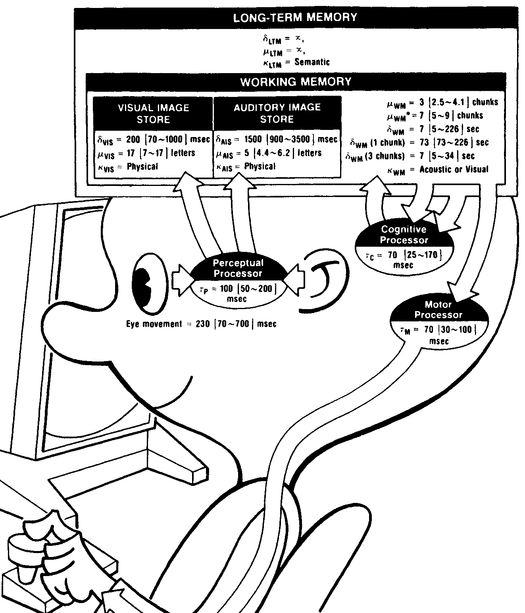
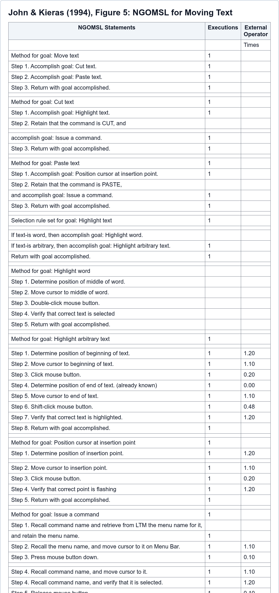
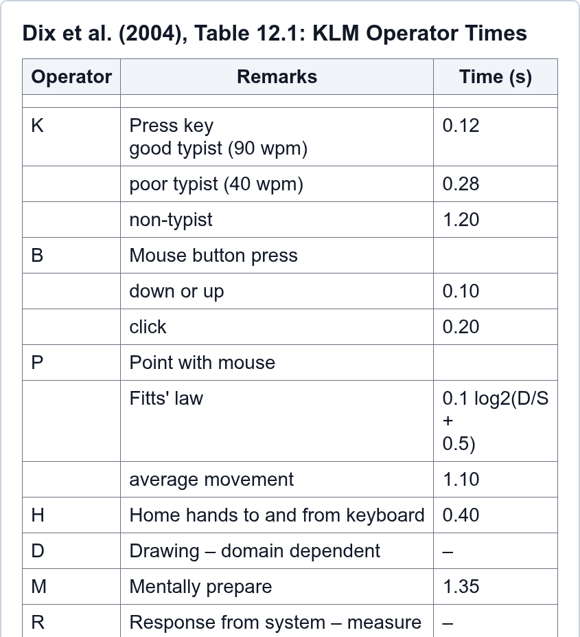
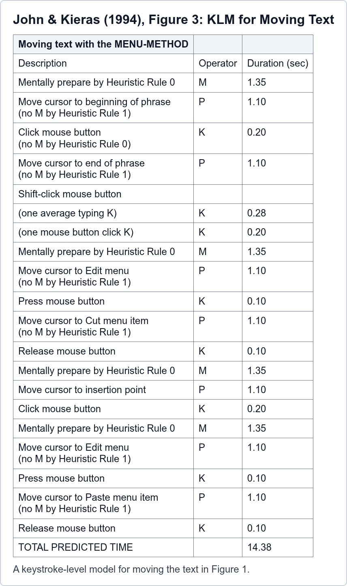
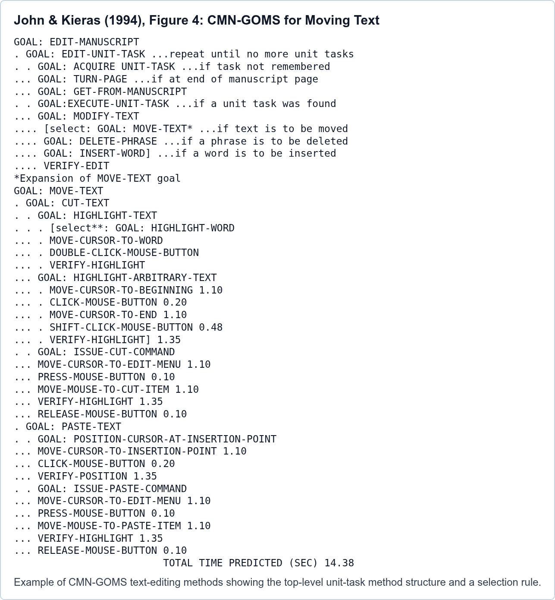
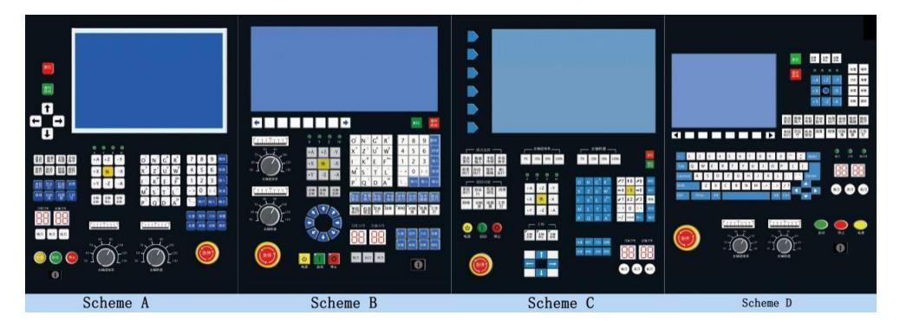
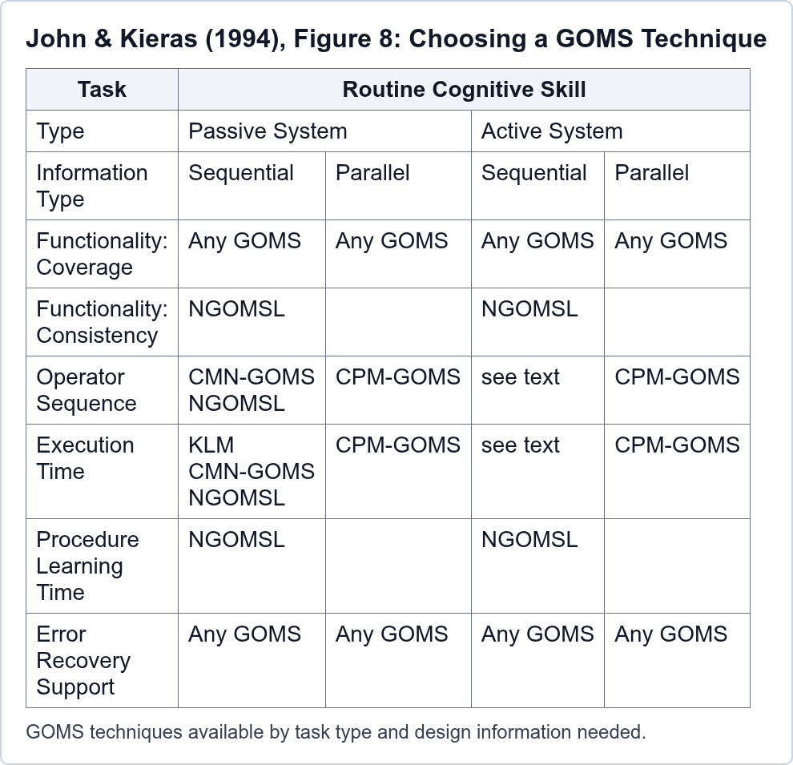

## Lesson Roadmap {#table-of-contents}

- Interface evaluation methods
- GOMS model structure
- NGOMSL and KLM
- KLM operators, rules, and examples
- Validation and extensions

::: {.notes}
This lesson introduces GOMS as a task-analysis and predictive-modeling technique. Keep the framing practical: GOMS is not a general theory of all user behavior. It is an engineering model for making useful, approximate predictions about routine, skilled, procedural interaction.

Lesson 2 will extend the discussion to CPM-GOMS, where multiple perceptual, cognitive, and motor processes can overlap, and to team models, where work is distributed across multiple people or agents.
:::

## Objectives

By the end, students can:

- Explain why GOMS helps interface design
- State GOMS/KLM assumptions
- Build a KLM for an Industry 4.0 task
- Validate a KLM against observed task data

::: {.notes}
Emphasize that the main deliverable is not memorizing operator values. The main deliverable is learning how to convert a task into an explicit method, assign primitive operators, estimate task time, and critique whether the model assumptions are appropriate.

A secondary objective is to prepare students for Lesson 2. KLM is intentionally simple and mostly serial. That simplicity is useful, but it also creates the need for CPM-GOMS when interaction contains overlapping looking, thinking, moving, speaking, monitoring, or waiting.
:::

## Evaluation Methods in HCI {.eval-methods-slide}

<table class="eval-methods">
  <thead>
    <tr>
      <th>Method source</th>
      <th>Information description</th>
    </tr>
  </thead>
  <tbody>
    <tr>
      <td>Verbal reports</td>
      <td>User accounts of thinking during system use</td>
    </tr>
    <tr>
      <td>Questionnaires</td>
      <td>Subjective user responses to targeted questions</td>
    </tr>
    <tr>
      <td>Use data</td>
      <td>Measures from actual or simulated system use</td>
    </tr>
    <tr>
      <td>Design walkthroughs</td>
      <td>End-user and development-team feedback on acceptability</td>
    </tr>
    <tr>
      <td>Heuristic reviews</td>
      <td>UI expert judgment about general acceptability</td>
    </tr>
    <tr class="theory-based-analysis">
      <td>Theory-based analysis</td>
      <td>Predictions of expert user behavior</td>
    </tr>
  </tbody>
</table>

::: {.footer .source-citation-footer}
Table adapted from Karat, 1997, &ldquo;User-centered software evaluation,&rdquo; Chap. 28, Table 1.
:::

::: {.notes}
This slide adapts Karat's Chapter 28, Table 1, in Helander et al., focusing on the method sources and the kind of information each source provides.

The first three rows are use-based sources: verbal reports, questionnaires, and use data. These rely on people using, trying, or responding to a system or prototype.

The next two rows are inspection-oriented sources: design walkthroughs and heuristic reviews. These are especially useful early because they can inform design decisions before a full system or large user study exists.

The green row is the bridge to this lesson. Theory-based analysis includes GOMS-family modeling: using a cognitive/task theory to predict expert user behavior. It is not a replacement for all user evaluation, but it can provide early ease-of-use predictions and compare design alternatives before implementation.

Source: Helander et al. (1997), Chapter 28, Table 1.
:::

## Theory-Based Task Analysis {.theory-task-analysis-slide}

:::: {.theory-task-layout}
::: {.theory-task-copy}
- Task analysis: describe what users must know and do to accomplish goals
- GOMS focuses on procedural "how-to" knowledge
- Represents tasks as goals, operators, methods, and selection rules
- Best fit: routine cognitive skills, not open-ended exploration
- Starts from top-level goals found through other task-analysis work
:::


::::

::: {.footer .source-citation-footer}
John and Kieras, 1994, &ldquo;The GOMS Family of Analysis Techniques,&rdquo; secs. 3.1-3.3 and fig. 2.
:::

::: {.notes}
This slide links directly back to the green row on the previous slide. GOMS is a theory-based analysis method because it analyzes tasks using explicit assumptions about human information processing.

John and Kieras Section 3 frames the GOMS family as a lattice. At the top is task analysis; at the bottom are conceptual frameworks for human information processing, especially serial and parallel stage models. GOMS sits in between: it is a way to analyze and represent tasks in a form connected to those cognitive assumptions.

Section 3.1 explains the conceptual-framework side. Stage models assume that interaction can be understood through perceptual, cognitive, and motor processing stages. The Model Human Processor is important because it turns those ideas into an engineering model that can support predictions about HCI performance.

Section 3.2 explains the computational-architecture level. These are more explicit models that can be run as simulations, such as CCT, ACT-R, Soar, and EPIC. John and Kieras note that, at the time, CCT was the ready-to-use computational basis for NGOMSL.

Section 3.3 is the key task-analysis point. General GOMS is under Task Analysis, but it is a specific kind of task analysis: it represents procedural "how-to-do-it" knowledge using goals, operators, methods, and selection rules.

Emphasize the three restrictions. First, GOMS is for procedural knowledge, not all knowledge about a system. Second, it is recommended for routine cognitive skills, not exploration or open-ended problem solving. Third, the analyst must already have a list of top-level user goals; GOMS does not discover that list by itself. Those goals come from interviews, observations, existing systems, broader task analysis, or analyst judgment.

Source: John and Kieras (1994), Section 3, especially Sections 3.1-3.3 and Figure 2.
:::

## GOMS as Engineering Model

- Approximate, not perfect
- Predictive, not merely descriptive
- Usable by designers
- Focused on procedural interaction

::: {.notes}
John and Kieras describe GOMS models as engineering models of human-computer interaction. Engineering models are deliberately approximate. They include enough detail to support design decisions, without trying to model every psychological process.

Use the “EPA mileage rating” analogy: GOMS predictions may not exactly match any particular user on any particular day, but they can be very useful for comparing alternatives under consistent assumptions.

The original Card, Moran, and Newell framing emphasizes a priori prediction, coverage of relevant HCI tasks, approximation, and learnability for practitioners.

This framing helps students avoid two mistakes: treating GOMS as exact truth, and dismissing it because it is approximate.
:::

## GOMS Architecture {.compact .goms-architecture-slide}

**GOMS model = Goals + Operators + Methods + Selection Rules**

- **Goals:** desired states that organize the task; they identify what is wanted, what methods are available, and what has already been tried
- **Operators:** elementary perceptual, cognitive, or motor acts; each changes the user's mental state or task environment and has an effect and duration
- **Methods:** learned procedures for achieving goals; conditional sequences of subgoals and operators driven by memory and task-environment tests
- **Selection rules:** if-then rules for choosing among competing methods; skilled choices are fast, smooth, and based on task conditions

::: {.footer .source-citation-footer}
Card, Moran, and Newell, 1983, &ldquo;The Psychology of Human-Computer Interaction,&rdquo; Chap. 5, sec. 5.1.
:::

::: {.notes}
This slide follows Card, Moran, and Newell's original definition of a GOMS model in Chapter 5, Section 5.1. Their key claim is that the user's cognitive structure for skilled interaction can be represented as goals, operators, methods, and selection rules.

A goal might be “Start CNC cutting program.” It is not just a label for the outcome; it also functions as a memory point for what the user is trying to do, which methods could be used, and what has already been attempted.

Operators are the model's executable units. Depending on the grain of analysis, an operator might be pressing a key, pointing to a target, mentally preparing for the next step, or verifying the displayed machine state. Card, Moran, and Newell emphasize that operators have effects and durations, which is what lets a GOMS model support time prediction.

A method is the ordered procedure for a goal: open the program screen, select the program, confirm it, and press Cycle Start. Methods are learned task knowledge available during skilled performance, not plans invented from scratch while acting.

A selection rule chooses among methods when more than one method is available. For example, if the correct CNC program is already loaded, use a shorter method that skips program selection; otherwise, use the full method. In skilled behavior, this choice should be quick and routine rather than a new problem-solving episode.

Source: Card, Moran, and Newell (1983), Chapter 5, Section 5.1.
:::

## Mini GOMS Example

```text
Goal: Start CNC cutting program
Method:
  1. Open Program screen
  2. Select required program
  3. Confirm program loaded
  4. Press Cycle Start
Selection rule:
  IF program already loaded, skip 1–3
```

::: {.notes}
Use this mini example to show why GOMS is more than a flowchart. The goal specifies the user’s intention. The method specifies what the user must know how to do. The selection rule captures procedural knowledge that depends on task state.

This also previews NGOMSL, which writes methods in a structured natural-language notation.
:::

## Model Human Processor

{.slide-figure .figure-mhp}

::: {.notes}
Card, Moran, and Newell introduce the Model Human Processor as a deliberately simplified information-processing model for HCI engineering. It is meant to help designers remember psychological facts and make approximate predictions, not to describe literally what is inside the head.

The model has two parts: memories and processors, plus principles of operation. Memories are described by capacity, decay time, and code type. Processors are described mainly by cycle time. The three interacting subsystems are perceptual, cognitive, and motor.

For the parameters in the figure, $\mu$ means storage capacity, $\delta$ means decay time or persistence of an item, $\kappa$ means the dominant code type used to represent the information, and $\tau$ means processor cycle time. The exact values differ by memory store or processor, but the general idea is the same: how much can be held, how long it remains available, what form the representation takes, and how quickly a processing cycle can complete.

The notation `100 [50-200] ms` means a nominal value followed by an estimated range. The first number is the middle or typical value Card, Moran, and Newell recommend for approximate engineering calculations. The bracketed values are plausible low and high bounds, reflecting task conditions, measurement conditions, practice, individual differences, and stimulus quality. For time parameters, the low value is faster and the high value is slower; for capacity parameters, the low value means less capacity and the high value means more capacity. This is why the model supports both a typical Middleman calculation and sensitivity checks using low and high parameter values.

Use this figure to connect the rest of the lesson to GOMS. Information flows from sensory input into perceptual memories, then into Working Memory through the Perceptual Processor. Working Memory is activated chunks in Long-Term Memory. The Cognitive Processor uses a recognize-act cycle to select actions, and the Motor Processor carries out those actions.

The model supports task analysis, calculation, and approximation. Card, Moran, and Newell recommend reasoning with nominal values and with plausible ranges: a Middleman, Fastman, and Slowman version of the user. Some tasks look serial, such as pressing a key in response to a light. Other skilled tasks, such as typing or reading, can pipeline perceptual, cognitive, and motor processes.

Section 2.3 is the caveat: this is a useful synthesis, not a settled complete theory. The memory "boxes," depth of processing, Working Memory span, interference, decay, and processor-control assumptions are simplifications chosen because they give designers a usable first approximation.

Source: Card, Moran, and Newell (1983), Chapter 2, especially section 2.1 and Figure 2.1.
:::

## Model Human Processor Parameters {.compact}

| Symbol | Meaning | Question answered |
|---|---|---|
| $\mu$ | capacity | How much can it hold? |
| $\delta$ | decay / persistence | How long is it available? |
| $\kappa$ | code | What form is it represented in? |
| $\tau$ | cycle time | How long is one processor cycle? |

- Format: nominal [low-high range]
- Nominal = Middleman engineering value
- Range = low to high parameter bounds
- Decay is degradation, not deletion
- Values synthesize empirical estimates

::: {.notes}
This slide makes the notation in Figure 2.1 explicit. Card, Moran, and Newell use memory parameters for capacity, decay, and code type, and processor parameters for cycle time.

Decay does not mean the information is completely gone at exactly the listed time. It means availability or retrievability is declining. For the sensory image stores, Card, Moran, and Newell use half-life as an index of decay: the point where probability of retrieval has fallen below about 50%. They also note that exponential decay is a useful approximation, not a claim that the trace disappears instantly.

For Working Memory, apparent decay is strongly shaped by interference. A chunk can become less accessible as new chunks are activated, and it can sometimes be refreshed or reconstructed if appropriate cues remain. In Long-Term Memory, failure to retrieve often means the right cue did not activate the item or that competing associations interfered, not that the knowledge was physically erased.

The notation such as `70 [25-170] ms` or `7 [5-9] chunks` should be read as a typical or nominal value followed by a plausible low-high range. The nominal value is the value to use for a first-pass Middleman calculation. The bracketed range gives low and high parameter values for sensitivity analysis.

The nominal values should not be treated as exact biological constants or simple averages from a single experiment. Card, Moran, and Newell chose them as practical engineering estimates from the available empirical literature. For example, they describe the nominal cognitive processor cycle time as about the median of estimates across several task phenomena, while the lower and upper bounds include the estimates they wanted the model to cover.

The range is intentionally broad because user performance changes with practice, effort, task pacing, stimulus quality, measurement conditions, and individual differences. The engineering use is to calculate a typical estimate and then check whether the design conclusion still holds under low and high assumptions.

Source: Card, Moran, and Newell (1983), Chapter 2, especially sections 2.1 and 2.2.
:::

## Perceptual Processor {.compact .mhp-callout-slide}

- Converts sensations into percepts
- Encodes selected input into symbols
- Combines events within one cycle
- Guides visual search and fixation
- Cycle time $\tau_{\mathrm{P}}$: 100 [50-200] ms

<div class="mhp-thumb" style="--mhp-x: 34%; --mhp-y: 39%; --mhp-w: 25%; --mhp-h: 11%;" aria-hidden="true">
  
  <div class="mhp-box"></div>
</div>

::: {.notes}
The Perceptual Processor turns sensory input into internal representations. The nominal cycle time $\tau_{\mathrm{P}}$ is about 100 ms, with a typical range from about 50 to 200 ms.

Events that occur within one perceptual cycle can be combined into one percept. Chapter 2 uses this idea to explain phenomena such as apparent motion, click fusion, and perceived causality in animation. For interface timing, very short delays can be perceptually invisible, while delays around the perceptual cycle can disrupt continuity.

Visual tasks are not just about the processor cycle. The eye obtains high detail only in the fovea, and the eyes move in saccades. The model uses about 230 ms for a typical eye movement, with a wide range depending on task and observer. Reading, scanning a display, and finding a target can therefore be dominated by eye movements rather than by the 100 ms perceptual cycle alone.

The Variable Perceptual Processor Rate Principle says that perceptual cycle time varies inversely with stimulus intensity. High-contrast, bright, salient signals are processed faster than faint or low-contrast signals. This gives a psychological reason for making critical state changes visible, persistent, and discriminable.

Source: Card, Moran, and Newell (1983), Chapter 2, sections 2.1 and 2.2.
:::

## Visual and Auditory Image Stores {.compact .mhp-callout-slide}

- Visual code $\kappa_{\mathrm{VIS}}$: physical trace
- Visual capacity $\mu_{\mathrm{VIS}}$: 17 [7-17] letters
- Visual duration $\delta_{\mathrm{VIS}}$: 200 [70-1000] ms
- Auditory code $\kappa_{\mathrm{AIS}}$: physical sound
- Auditory capacity $\mu_{\mathrm{AIS}}$: 5 [4.4-6.2] letters
- Auditory duration $\delta_{\mathrm{AIS}}$: 1500 [900-3500] ms
- Decay $\delta$ is a retrieval half-life estimate

<div class="mhp-thumb" style="--mhp-x: 16%; --mhp-y: 12%; --mhp-w: 50%; --mhp-h: 18%;" aria-hidden="true">
  
  <div class="mhp-box"></div>
</div>

::: {.notes}
The perceptual memories are short-lived stores that hold sensory information before it has been fully recognized and symbolically encoded. Card, Moran, and Newell distinguish the Visual Image Store and Auditory Image Store.

The code type is physical. A visual stimulus is represented in terms of physical features such as shape, curvature, intensity, and spatial pattern before it is represented as a recognized symbol. This matters for interface design because users can select from the perceptual store only by physical properties before recognition. After a quick display of colored letters and numbers, for example, a person can attend to the green items or the top half, but not to "the even digits" before identifying the items.

Useful nominal values from the model are: Visual Image Store half-life about 200 ms, capacity about 17 letters; Auditory Image Store half-life about 1500 ms, capacity about 5 letters. Auditory information persists longer because it often needs to be interpreted over time.

For dashboards, alarms, and machine HMIs, the design implication is that fleeting displays and transient alerts should not require users to extract many symbolic items after the fact. If the trace is brief and complex, Working Memory fills before everything can be transferred.

Source: Card, Moran, and Newell (1983), Chapter 2, section 2.1.
:::

## Working Memory {.compact .mhp-callout-slide}

- Active chunks for the current task
- Chunk = meaningful unit for this user
- Code $\kappa_{\mathrm{WM}}$: acoustic or visual
- Pure capacity $\mu_{\mathrm{WM}}$: 3 [2.5-4.1] chunks
- Effective span $\mu^*_{\mathrm{WM}}$: 7 [5-9] chunks
- Pure = raw slots; span = chunked/rehearsed units
- Interference: new chunks make old chunks harder to access
- Decay $\delta_{\mathrm{WM}}$: 7 [5-226] sec

<div class="mhp-thumb" style="--mhp-x: 66%; --mhp-y: 12%; --mhp-w: 30%; --mhp-h: 20%;" aria-hidden="true">
  
  <div class="mhp-box"></div>
</div>

::: {.notes}
This slide separates the Working Memory variables from the Visual Image Store and Auditory Image Store. Those image stores are perceptual memories. Working Memory is the active task workspace used by the Cognitive Processor.

Working Memory holds the intermediate products of thinking and the representations produced by perception. Functionally, it is where mental operations get their operands and leave their outputs. Structurally, Card, Moran, and Newell model it as activated chunks in Long-Term Memory.

The key unit is the chunk. What counts as a chunk depends on the user and their prior knowledge. A random sequence can exceed span, while an only slightly different sequence can become easy if it maps onto familiar chunks. This is why expertise matters so much in KLM and GOMS: an expert may treat a procedure, command, or display state as one chunk that a novice must handle as several separate items.

Working Memory commonly uses acoustic or visual symbolic codes. The model distinguishes a pure capacity of about 3 chunks from an effective span of about 7 chunks, because familiar structures and rehearsal let people maintain more useful units than raw storage alone would suggest. It decays or becomes inaccessible over seconds, especially under interference. The model gives a rough half-life of about 7 seconds for three chunks, but much longer for a single chunk. Rehearsal can keep a small number of chunks active, but it consumes attention and competes with other mental work.

For interface design, reduce Working Memory load by chunking information, keeping task-relevant values visible, using meaningful labels, avoiding easily confused codes, and not requiring users to remember arbitrary strings across intervening steps.

Source: Card, Moran, and Newell (1983), Chapter 2, sections 2.1 and 2.2.
:::

## Cognitive Long-Term Memory {.compact .mhp-callout-slide}

- Learned facts/procedures $\kappa_{\mathrm{LTM}}$: semantic
- Capacity $\mu_{\mathrm{LTM}}$: effectively unlimited
- Duration $\delta_{\mathrm{LTM}}$: effectively permanent
- Retrieves by associative cues
- Similar items can interfere
- Fast to read, slow to write

<div class="mhp-thumb" style="--mhp-x: 14%; --mhp-y: 1%; --mhp-w: 84%; --mhp-h: 31%;" aria-hidden="true">
  
  <div class="mhp-box"></div>
</div>

::: {.notes}
Long-Term Memory holds facts, procedures, histories, and associations. In the Model Human Processor it is coded primarily semantically, with no modeled erasure and no practical capacity limit for the engineering questions in the chapter.

Retrieval is associative. A cue in Working Memory activates related chunks in Long-Term Memory. Failure to remember often means the right retrieval route was not activated, not that the knowledge is gone.

Two principles are central. The Encoding Specificity Principle says that how information is encoded determines which retrieval cues will work later. The Discrimination Principle says retrieval difficulty depends on competing candidates relative to the cue. Similar command names, similar procedures, or semantically overlapping systems can interfere with each other.

Writing to Long-Term Memory is slow compared with reading. The Cognitive Processor can access Long-Term Memory on each cognitive cycle, but forming retrievable new knowledge requires time in Working Memory and useful associations. This is why training, naming, examples, and consistency matter: they shape the cues users will later have available.

Source: Card, Moran, and Newell (1983), Chapter 2, sections 2.1 and 2.2.
:::

## Cognitive Processor {.compact .mhp-callout-slide}

- Interprets the current task state
- Retrieves knowledge and procedures
- Chooses the next deliberate action
- Updates Working Memory each cycle
- Cycle time $\tau_{\mathrm{C}}$: 70 [25-170] ms

<div class="mhp-thumb" style="--mhp-x: 67%; --mhp-y: 35%; --mhp-w: 20%; --mhp-h: 11%;" aria-hidden="true">
  
  <div class="mhp-box"></div>
</div>

::: {.notes}
The Cognitive Processor operates through a recognize-act cycle. On each cycle, the contents of Working Memory cue associated actions or knowledge in Long-Term Memory; those actions then modify Working Memory and set up the next cycle.

The nominal cognitive cycle time $\tau_{\mathrm{C}}$ is about 70 ms, with a broad range. Card, Moran, and Newell use this value to explain simple reaction tasks: a perceptual cycle plus a cognitive cycle plus a motor cycle gives about 240 ms. More complex judgments add cycles. Physical matches, name matches, class matches, and choice reactions become slower as additional recognition, classification, or decision steps are required.

The Variable Cognitive Processor Rate Principle says the cycle can shorten under higher effort, higher task demand, information load, or practice. The Uncertainty Principle adds that decision time increases with uncertainty, as in Hick's Law.

The cognitive system can recognize many things in parallel, but deliberate action is effectively serial. This is the bridge to GOMS: a method can be modeled as a sequence of operators because deliberate cognitive control tends to choose one next action at a time, even though perception and motor execution may overlap in skilled behavior.

Chapter 2 also uses the Cognitive Processor to frame complex task behavior. Operator sequences can often be added to approximate total task time. The Rationality Principle says behavior is shaped by goals, task structure, operators, inputs, knowledge, and process limits. The Problem Space Principle says problem solving can be described as states of knowledge, operators, constraints, and control knowledge.

Source: Card, Moran, and Newell (1983), Chapter 2, sections 2.1 and 2.2.
:::

## Motor System {.compact .mhp-callout-slide}

- Turns selected actions into movement
- Controls eyes, head, hands, fingers
- Executes skilled action bursts
- Uses slower feedback for correction
- Cycle time $\tau_{\mathrm{M}}$: 70 [30-100] ms

<div class="mhp-thumb" style="--mhp-x: 73%; --mhp-y: 47%; --mhp-w: 23%; --mhp-h: 13%;" aria-hidden="true">
  
  <div class="mhp-box"></div>
</div>

::: {.notes}
The motor system translates thought into action through voluntary muscles. For computer interaction, the most important effectors are the arm-hand-finger system and the head-eye system.

Card, Moran, and Newell model movement as discrete micromovements rather than continuous motion. The nominal Motor Processor cycle time $\tau_{\mathrm{M}}$ is about 70 ms. Because the feedback loop from action to perception is much longer, roughly 200 to 500 ms, rapid acts such as typing and speaking are executed as preprogrammed bursts rather than as fully closed-loop movements.

The chapter's pen-movement example shows two paths. Open-loop motor commands can be issued at roughly the motor cycle rate. Closed-loop corrections require perceiving the result, deciding on a correction, and issuing a new motor command, so the cycle is closer to $\tau_{\mathrm{P}} + \tau_{\mathrm{C}} + \tau_{\mathrm{M}}$, about 240 ms nominally.

For KLM, this helps explain why not every small motor movement should be treated as a visually corrected decision. Skilled, practiced actions can run as motor routines; visually guided corrections, target acquisition, and verification add time.

Source: Card, Moran, and Newell (1983), Chapter 2, section 2.1.
:::

## Motor Skill and Fitts' Law {.compact .mhp-callout-slide}

- Predicts aimed movement time
- Links layout to physical effort
- $T_{\mathrm{pos}} = I_{\mathrm{M}} \log_2(D/S + 0.5)$
- Smaller/farther targets take longer
- Practice speeds repeated routines
- $I_{\mathrm{M}} \approx 100$ ms/bit

<div class="mhp-thumb" style="--mhp-x: 0%; --mhp-y: 84%; --mhp-w: 27%; --mhp-h: 16%;" aria-hidden="true">
  
  <div class="mhp-box"></div>
</div>

::: {.notes}
Fitts' Law models the time to move to a target as a function of distance $D$ and target size $S$. The important design idea is relative precision: far targets and small targets take longer because they require more corrective control.

Card, Moran, and Newell derive the law from repeated perceptual-cognitive-motor corrections, then use empirical data to set a practical value of about 100 ms per bit, with a typical range around 70 to 120 ms per bit depending on task conditions and measurement method. They recommend a Welford-style form, shown on the slide as $T_{\mathrm{pos}} = I_{\mathrm{M}} \log_2(D/S + 0.5)$.

The same motor-skill section also emphasizes the Power Law of Practice: task time decreases as a power function of practice. This applies broadly to skilled cognitive and perceptual-motor behavior. For keystroking, practice produces large differences: novice, moderate, expert, and champion rates can differ by more than an order of magnitude.

For interface evaluation, use average KLM pointing times for quick classroom estimates, but use Fitts' Law when target distance and target size are central to the design question. In industrial HMIs, this matters for high-frequency controls, emergency actions, gloved use, touchscreens, and dense dashboards.

Source: Card, Moran, and Newell (1983), Chapter 2, especially section 2.2.
:::

## GOMS/KLM Assumptions

- Routine cognitive skill
- Skilled, knowledgeable user
- Known method and starting state
- Error-free execution
- Measured or estimated response times

::: {.notes}
These are boundary conditions. Basic GOMS/KLM is strongest when the task is routine, the user already knows what to do, the method is known, and the analyst can represent the procedure as a sequence of primitive operators.

The model predicts procedural cost, not user acceptance, trust, motivation, fatigue, emotion, organizational fit, or deep conceptual understanding. Olson and Olson’s review, as discussed by John & Kieras, is useful for emphasizing what cognitive modeling can and cannot address.

Warn students not to use simple KLM for open-ended exploration, diagnosis, creative problem solving, or emergency improvisation unless the model is extended and the limitations are clearly stated.
:::

## NGOMSL {.compact}

- Natural GOMS Language
- Structured procedure notation
- Shows methods and selection rules
- Estimates execution and learning time

{.slide-figure .figure-tall}

::: {.notes}
NGOMSL stands for Natural GOMS Language. It is a readable, program-like notation for writing GOMS methods and selection rules.

NGOMSL is more explicit than KLM because it shows method structure, not just an operator sequence. It is useful for training, documentation, help-system design, and learning-time estimation.

Explain that NGOMSL is best for hierarchical, sequential procedures. It is less appropriate when perceptual, cognitive, and motor processes overlap heavily; those cases motivate CPM-GOMS.

John & Kieras Figure 5 shows NGOMSL methods for moving text and includes both execution-time and procedure-learning-time estimates.

Wagner et al. (2006) provide an applied example of NGOMSL/GOMS modeling in a multi-robot interface context.
:::

## NGOMSL Mini Example

```text
Method for goal: Start CNC cutting program
Step 1. Accomplish goal: Open program screen.
Step 2. Accomplish goal: Select required program.
Step 3. Accomplish goal: Confirm program is loaded.
Step 4. Accomplish goal: Start cycle.
Step 5. Return with goal accomplished.
```

::: {.notes}
Point out that NGOMSL reads like a simplified program for the user’s procedural knowledge. Each step can be expanded into submethods until the operators are primitive enough for analysis.

Also mention that NGOMSL can reveal inconsistencies in interface procedure design. If two similar tasks require very different procedures, users may need more learning and may be more likely to make slips.
:::

## Keystroke-Level Model

- Simplest GOMS variant
- Analyst supplies the method
- Convert method into operators
- Sum operator times

```text
T_task = ΣK + ΣB + ΣP + ΣH + ΣD + ΣM + ΣR
```

::: {.notes}
KLM is the most accessible GOMS technique. It is fast, practical, and easy to teach.

The analyst defines the task, user, starting state, and method. Then each action is converted to a primitive operator such as K, B, P, H, D, M, or R. Predicted time is simply the sum of those operator times.

KLM is particularly useful for comparing alternatives for the same benchmark task. It does not determine which method users will discover or choose unless the analyst explicitly defines methods and selection rules.

Sources: Card, Moran, & Newell (1983); John & Kieras (1994); Dix et al. (2004), Chapter 12.
:::

## KLM Operators

{.slide-figure .figure-wide}

::: {.notes}
Keep the slide concise; discuss details verbally.

K depends heavily on user skill. Dix summarizes examples such as 0.12s for a very skilled typist, 0.28s for a less skilled typist, and longer values for non-typists. B is commonly 0.10s for button-down or button-up, or 0.20s for a click. P is often approximated as 1.10s, but can be replaced by Fitts’ Law when distance and target size matter. H is homing time between input devices. D is drawing or gesture time and is domain dependent. M is mental preparation. R is system response time and should be measured when possible.

For CNC panels, touchscreens, gloves, robot-control stations, or VR interfaces, use standard values for classroom exercises but measure task-specific values for research or design decisions.

Sources: Card, Moran, & Newell (1983); Dix et al. (2004), Table 12.1; Kieras in Diaper & Stanton (2004).
:::

## Building a KLM

1. Define benchmark task
2. Define user and starting state
3. Write exact method
4. Translate into operators
5. Add M and R
6. Sum and compare

::: {.notes}
Students often skip the starting state. Do not let them. KLM predictions change drastically depending on whether text is already selected, whether the cursor is active, whether the user’s hand is on the mouse or keyboard, whether the target is visible, and whether the system is already in the right mode.

The method must be exact enough that another analyst could reproduce the operator sequence. Ambiguous verbs like “use the menu” should be decomposed into point, button-down, drag/point, button-up, and any required mental operators.

After summing, compare alternatives or validate against observations. The value of a KLM is usually comparative rather than absolute.
:::

## Mental Operator Rules

- Place **M** before cognitive units
- Do not split practiced chunks unnecessarily
- Chunking depends on expertise
- Treat uncertainty as sensitivity analysis

::: {.notes}
Most KLM debates are debates about M. M represents mental preparation before an action or action chunk. It is not a model of deep reasoning.

Place M before choosing a command, recalling what to do next, or verifying what action is appropriate. Avoid adding separate M operators inside a well-practiced chunk.

For direct manipulation, John and Kieras recommend modified placement rules: place M before command-selecting pointing actions or before the start of a direct-manipulation cognitive unit.

Olson and Olson refined estimates for mental operations, and Lane et al. refined M-placement heuristics for fixed menu-choice subtasks, as summarized by John & Kieras.

Teaching tactic: if students disagree, make two models: a conservative model with more M operators and an expert-chunked model with fewer M operators. Compare whether the design conclusion changes.
:::

## Example: Copy/Paste Task

**Task state**

- Text already selected
- Insertion point visible
- Compare shortcut vs. menu
- Values: M=1.35, P=1.10, B=0.20, K=0.28

::: {.notes}
This example is intentionally simple and familiar. It lets students focus on KLM mechanics rather than domain complexity.

Be explicit about assumptions. If the insertion point is already active, the shortcut method is much faster. If the user must move to the insertion point, the shortcut method needs pointing and clicking too. If the user does not know shortcuts, menu interaction may be more realistic.

This is a good moment to emphasize that KLM models are conditional claims: “Given this user, task state, method, and operator-value set, the predicted execution time is X.”
:::

## Copy/Paste KLM Comparison

| Method | Operator sequence | Time |
|---|---|---:|
| Shortcut | M 2K M 2K | 3.82s |
| Menu | 3M 5P 5B | 10.15s |

- Shortcut is faster for skilled users
- Menu may be more discoverable
- State assumptions matter

::: {.notes}
For the shortcut method, the model is M + 2K + M + 2K. With K = 0.28s, this is 1.35 + 0.56 + 1.35 + 0.56 = 3.82s.

For the menu method, the model includes preparing to copy, pointing to the Edit menu, mouse down, pointing to Copy, mouse up, preparing to position the insertion point, pointing to the insertion point, clicking, preparing to paste, pointing to Edit, mouse down, pointing to Paste, and mouse up. That aggregates to 3M + 5P + 5B, where the B total is 0.60s because some button actions are down/up rather than full clicks.

Interpretation: the shortcut method is faster only under the stated assumptions. The menu method may be slower but more discoverable for novices. This distinction is a design tradeoff, not just a calculation.

Suggested figure: pair this slide with John & Kieras Figure 3, which shows KLM for a moving-text task and demonstrates M placement before command-oriented chunks.
:::

## Literature Example: Moving Text {.dense}

- Task: move phrase in word processor
- KLM prediction: **14.38s**
- CMN-GOMS prediction: **14.38s**
- NGOMSL prediction: **16.38s**

::: {.figure-grid}
{.slide-figure}
{.slide-figure}
{.slide-figure}
:::

::: {.notes}
John & Kieras use one text-editing task to illustrate several GOMS variants. The KLM and CMN-GOMS predictions match at 14.38 seconds for the example. NGOMSL predicts 16.38 seconds because it represents additional cognitive overhead and method structure more explicitly.

The NGOMSL example also estimates procedure learning time. This is a useful distinction: KLM estimates execution time, while NGOMSL can also estimate learning time for procedural knowledge.

Use Figures 3, 4, and 5 side by side if possible. Figure 3 shows the KLM sequence. Figure 4 shows the CMN-GOMS hierarchy and selection rule. Figure 5 shows the NGOMSL method listing.
:::

## Industry 4.0 Example: CNC HMI {.compact}

**Task:** start a CNC cutting program

- Trained operator
- Known program and part ID
- Touchscreen or mouse input
- No errors modeled
- R values measured/estimated

{.slide-figure .figure-wide}

::: {.notes}
Dou et al. describe CNC control panels as including areas such as total control, pattern selection, spindle control, program edit, and tool changer areas. They also emphasize that CNC HMI design affects operator efficiency and experience, and that poor designs can create burden when they do not match the operator’s mental model.

This makes CNC control a good Industry 4.0 example: it is procedural, safety-relevant, and HMI layout matters.

State the assumptions before showing the KLM. The operator is trained. The program name and part ID are known. The task is routine. There are no errors. The program list opens after 0.80s, and machine confirmation takes 1.00s.

Suggested custom visual: simple CNC panel AOI diagram with Program Edit, Pattern Selection, Spindle Control, Tool Changer, Cycle Start, and Alarm/Status Area.
:::

## CNC KLM Model

```text
M P B R  M P B  M P B R  M P B
```

| Component | Count | Time |
|---|---:|---:|
| M | 4 | 5.40s |
| P | 4 | 4.40s |
| B | 4 | 0.80s |
| R | 2 | 1.80s |
| **Total** |  | **12.40s** |

::: {.notes}
Walk through the expanded procedure verbally:

1. Prepare to open the program screen. 2. Point to Program Edit. 3. Select it. 4. Wait for program list. 5. Choose target program. 6. Point to program ID. 7. Select program. 8. Prepare to load program. 9. Point to Load/Run. 10. Select Load/Run. 11. Wait for confirmation. 12. Verify ready state. 13. Point to Cycle Start. 14. Press Cycle Start.

The total is 4M + 4P + 4B + 2R = 5.40 + 4.40 + 0.80 + 1.80 = 12.40 seconds.

Discussion prompts: What changes if the operator searches a long program list? What if Program Edit is far from Cycle Start? What if system response is 3.0s instead of 0.8s? What if safety verification is required before Cycle Start? What if gloves, lighting, or screen size alter pointing time?
:::

## Validating KLM

- Record same benchmark task
- Separate execution, wait, error, and recovery time
- Compare predicted vs. observed time
- Re-estimate task-specific values if needed
- Report design-relevant differences

::: {.notes}
Validation checks whether the model is good enough for the design decision. It does not need to prove that the model perfectly predicts every user.

A practical validation process: record trained users performing the same benchmark task; capture time-stamped actions through video, screen logs, interaction logs, or eye tracking; separate user execution time from system response time; remove or separately model errors and recovery; compare predicted and observed times; adjust task-specific operator values if needed.

John and Kieras emphasize that GOMS predictions are especially useful for comparing alternatives. A model that predicts the direction and rough magnitude of differences may be sufficient for early design.
:::

## Validation Data Sources

- Screen or interaction logs
- Video coding
- Eye tracking
- Physiological data
- Post-task interview / RTA

::: {.notes}
Use multiple data sources when a single measure does not explain performance. Dou et al. combine physiological data, eye tracking, behavior analysis, and visualization to evaluate CNC control-panel schemes.

Eye tracking can help identify visual search, verification, and attention allocation. Land and Tatler argue that gaze during natural tasks is strongly tied to the information needed for action. Meyer et al. show how eye-tracking stimulated retrospective think-aloud can reveal decision cues in air traffic control.

Do not overclaim eye tracking. A fixation tells us where the eyes were directed, not automatically what the user understood. Combining gaze data with task context, logs, and post-task explanation is stronger.
:::

## Weaknesses of KLM

- Assumes skilled, error-free performance
- Weak for exploration and diagnosis
- Does not discover missing goals
- Mostly serial
- Sensitive to analyst assumptions

::: {.notes}
KLM is powerful because it is simple, but that simplicity is also its boundary.

It assumes the user already knows what to do. It does not model novice exploration, errors, recovery, fatigue, motivation, trust, acceptance, or organizational fit unless extended. It may also underrepresent visual search and verification unless those activities are explicitly included.

The model can hide analyst assumptions if the task state, method, M placements, and operator values are not documented. Require students to report assumptions with every KLM.

Bridge to Lesson 2: when the user can look, think, speak, and move in overlapping streams, or when multiple people coordinate, move from KLM to CPM-GOMS or team models.
:::

## Extension: Placement of M

- M = preparation for an action chunk
- More expertise → larger chunks
- Direct manipulation needs care
- Model uncertainty explicitly

::: {.notes}
M placement is the most common source of disagreement. Treat it as a modeling decision, not a hidden truth.

Experienced users combine actions into larger chunks, reducing the number of M operators. Novices may require more mental preparation because they must recall commands, interpret labels, or verify task state more often.

Direct-manipulation interfaces need careful M placement because pointing can be part of selecting a command or part of executing a physical-like action. John & Kieras discuss modifications to the original KLM rules for direct manipulation.

Class exercise: give the same task to students and ask for two models: conservative and expert-chunked. Compare the predicted difference.
:::

## Extension: Task-Specific M

Industry 4.0 mental checks may include:

- Verify part / work order
- Check tool path or recipe
- Confirm safety interlock
- Interpret alarm severity
- Confirm robot behavior

::: {.notes}
Some domains require mental operators that are not well represented by generic “prepare” pauses. In CNC, welding, robot control, and manufacturing execution systems, users may repeatedly verify state before committing to action.

Estimate task-specific M by using video, logs, eye tracking, and interviews. Repeated fixations on status or alarm areas before a command may suggest verification activity. Retrospective think-aloud can help identify what was being checked.

Replace generic 1.35s M with measured task-specific values when verification dominates the task. Document the evidence used to justify the custom value.

Sources: Dou et al. (2017); Wagner et al. (2006); Land & Tatler (2009); Meyer et al. (2022).
:::

## Extension: Fitts’ Law

Use when pointing depends on layout:

- Small targets
- Large distances
- Gloves or touchscreens
- Alternative panel layouts

```text
T = a + b log2(D / W + 1)
```

::: {.notes}
For quick classroom estimates, use P = 1.10s. Replace average P with Fitts’ Law when target distance and width are central to the design question.

D is distance to the target. W is target width. a and b are empirically estimated constants.

Design implication: large, nearby, frequently used controls reduce pointing time. For CNC panels, Cycle Start, Feed Hold, Program Select, and alarm acknowledgement should be laid out with both speed and safety in mind. However, safety-critical controls may also require protection against accidental activation, so speed is not the only design criterion.

Sources: Card, Moran, & Newell (1983); Dix et al. (2004); Gong & Kieras as summarized in Kieras/Helander.
:::

## Extension: Learning

- KLM predicts execution time
- NGOMSL can estimate learning time
- Practice reduces M through chunking
- Domain knowledge remains outside the model

::: {.notes}
KLM assumes the method is already known. It is not a learning model.

NGOMSL can estimate procedure learning time from the amount and similarity of procedural knowledge. This makes it more useful when the design question involves training, documentation, or help-system design.

Use caution in high-domain-knowledge systems. NGOMSL can estimate learning of the procedure in the model, but not all domain knowledge needed to operate a CNC machine, robot team, aircraft system, or manufacturing process.

Example: a novice CNC operator may need explicit mental steps for locating Program Edit, interpreting program IDs, confirming the correct part, and interpreting ready status. A trained operator may chunk these into one routine “load program” method.
:::

## Choosing a GOMS Variant {.compact}

| Question | Technique |
|---|---|
| Fast execution estimate | KLM |
| Procedure structure | CMN-GOMS / NGOMSL |
| Learning time | NGOMSL |
| Parallel activity | CPM-GOMS |
| Team coordination | Team / distributed models |

{.slide-figure .figure-wide}

::: {.notes}
Use this slide to consolidate the lesson and bridge to Lesson 2.

KLM is the fastest and simplest model. CMN-GOMS and NGOMSL provide more explicit method structures. NGOMSL is useful when learning time and documentation matter. CPM-GOMS is needed when perceptual, cognitive, motor, and system processes overlap. Team or distributed models are needed when multiple people or agents coordinate.

John & Kieras Figure 8 is the key summary figure for choosing among GOMS methods.
:::

## Exit Activity

Build a KLM for one routine task:

- CNC: load/start program
- MES: acknowledge alarm
- Dashboard: trace heat-lot
- Robot UI: add behavior
- Word processor: move text

::: {.notes}
Student deliverables should include: task description, assumed user, starting state, method steps, operator table, predicted time, validation plan, and one design change expected to reduce execution time.

Encourage students to choose a task that is routine enough for KLM. If their task involves diagnosis, exploration, or multi-person coordination, have them identify what KLM can model and what would require a different technique.
:::

## Figure Checklist

- Evaluation methods matrix
- Card, Moran, & Newell Fig. 2.1: Model Human Processor
- Kieras Fig. 6.2: GOMS meta-model
- Dix Table 12.1: KLM operators
- John & Kieras Figs. 3–5: text editing examples
- John & Kieras Fig. 8: technique selection
- Custom CNC HMI AOI diagram

::: {.notes}
This slide can remain at the end of the instructor version or be removed from the student version.

For a polished deck, insert or redraw the figures where they are referenced:

1. Evaluation methods matrix: custom 2×2.
2. Card, Moran, and Newell Figure 2.1: Model Human Processor memories and processors.
3. Kieras Figure 6.2: task meta-model from Diaper & Stanton.
4. Dix Table 12.1: KLM operator values.
5. John & Kieras Figures 3–5: KLM, CMN-GOMS, and NGOMSL for the same moving-text task.
6. John & Kieras Figure 8: matching GOMS variants to design questions.
7. Custom CNC HMI AOI diagram based on Dou et al.’s control-panel areas.
:::

## Core Sources

- Card, Moran, & Newell (1983)
- John & Kieras (1994)
- Kieras in Diaper & Stanton (2004)
- Olson & Olson (1990)
- Lane et al. (1993)
- Dix et al. (2004)
- Dou et al. (2017)
- Wagner et al. (2006)

::: {.notes}
Source integrity note: the working set includes local source files for Card, Moran, & Newell (1983), John & Kieras (1994), Kieras/Diaper task-analysis material, Dix et al. (2004), CNC-HMI evaluation, multi-robot GOMS modeling, and several eye-tracking/task-analysis sources. Standalone copies of Olson & Olson (1990), Lane et al. (1993), and a separate Kieras presentation were not available as independent uploaded files in the working set. Those sources are referenced where the uploaded documents summarize or cite them.

Additional useful supporting sources for validation and visual task analysis include Land & Tatler (2009), Meyer et al. (2022), Starke et al. (2017), and related eye-tracking/control-room studies.
:::
